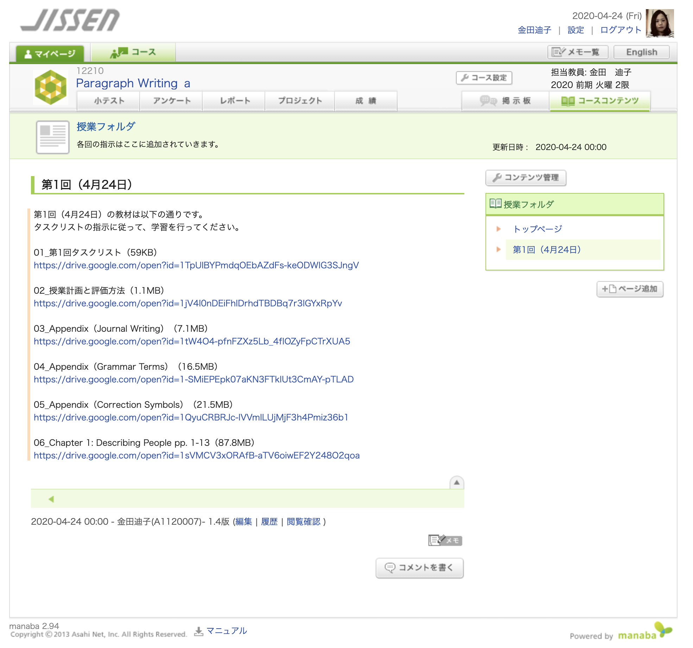
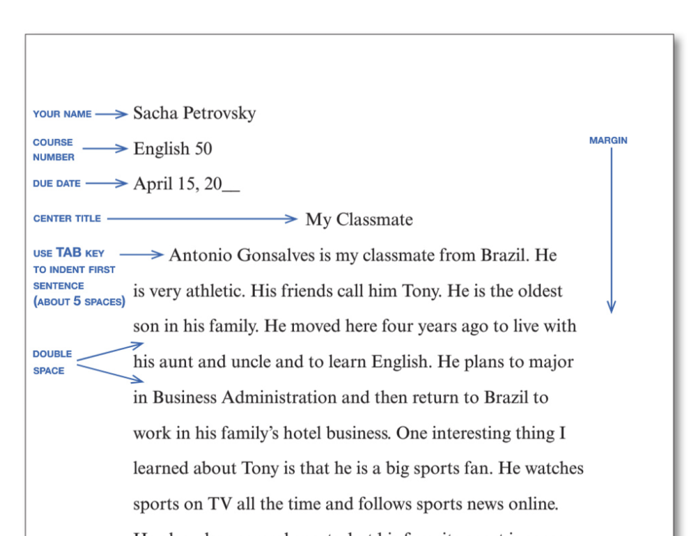
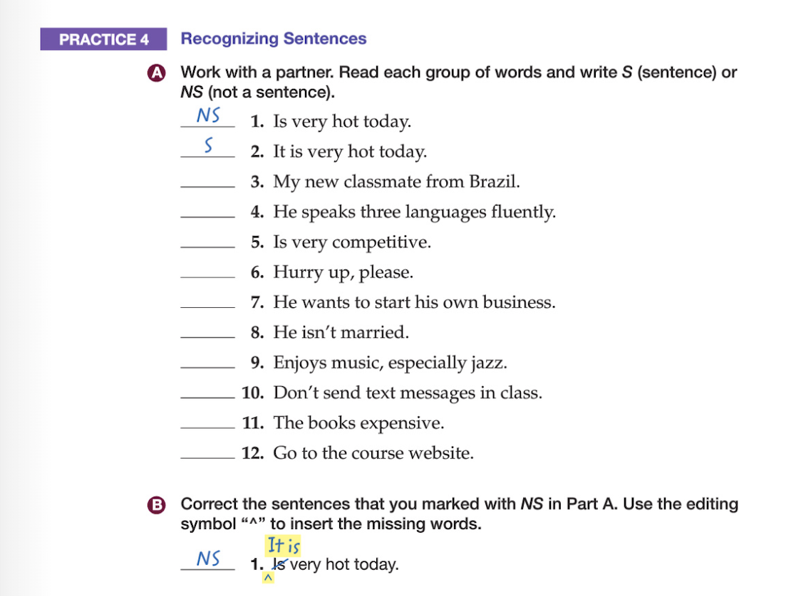
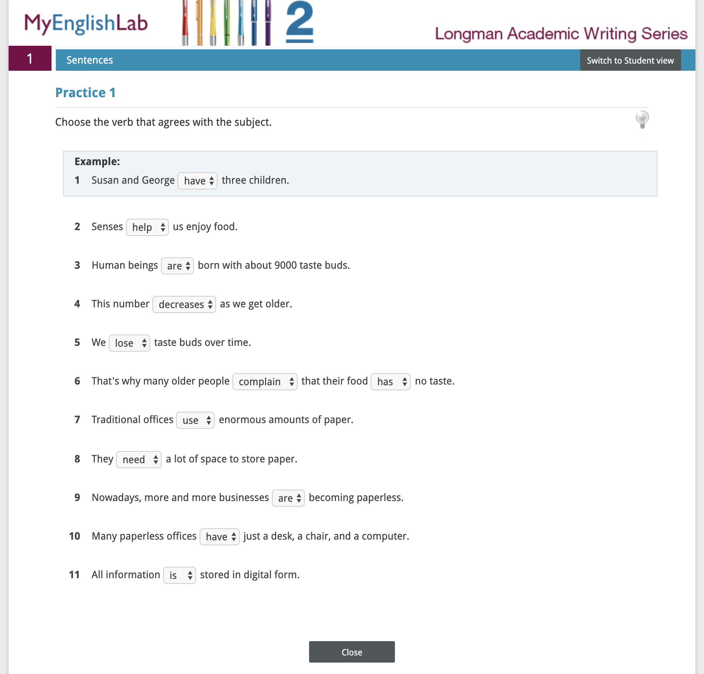
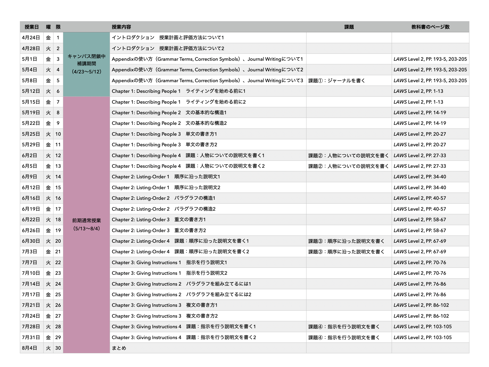

# 授業計画と評価方法  
Github版 2020年4月24日

## 01 授業計画について
- Paragraph Writing a が、週2回の授業からなる科目であること、始まる時間について確認しましょう。
- Paragraph Writing a の、1週間の流れについて確認しましょう。
- オンライン補講期間のスケジュールについて確認しましょう。
Paragraph Writing a は、1週間に2回の授業（金曜日 13:15-14:45、火曜日 10:45-12:15）で構成される科目です。オンライン授業を行っている間は、*教材は授業開始時間（毎週金曜日13:15、火曜日10:45）に更新されます*ので、その時間にmanabaをチェックしてください。

一週間の授業は、火曜日のレクチャー、金曜日のフィードバックで進んで行きます。次のページから、Paragraph Writing a の授業の進め方について確認して行きます。

---

### 火曜日の授業

毎週火曜日には、manabaに*①レクチャー*と*②タスクリスト*が掲載されます。「**コンテンツ**」タブからその日の授業のページを開き、その日に追加された教材を受け取ってください。

受講者はレクチャーの内容をよく理解し、タスクリストに挙げられている課題に取り組んでください。

manabaをチェックし、教材を受け取ったかどうかの確認は、*③manaba内のチェックリスト*で行います。レクチャーとタスクリストを受け取ったら、定められた時間の間にmanabaの「**小テスト**」タブに用意されているチェックリストに回答し、提出してください。チェックリストの提出を、オンライン授業への出席とみなしますので、毎回の授業で、*教材を受け取り、チェックリストに回答する*ことを習慣づけてください。

タスクの提出を求められた場合、定められた時間の間に提出して下さい。（レクチャーとタスクの量は、授業時間内の90分間で完結するように設定されています。）

---

### 金曜日の授業

金曜日には、*①レクチャーの続き（フィードバック）*と、*②次週のレクチャーの範囲*がmanabaに掲載されます。火曜日と同様に、「**コンテンツ**」タブのページから教材を受け取ってください。

教材を確認したら、定められた時間の間にmanabaの「**小テスト**」タブに用意されている*③チェックリスト*に回答して提出してください。

また、*④ライティング課題*が課される場合、課題は金曜日に出されます。指示に従って課題を進めてください。課題の提出が求められたときには、定められた期間の間に、manabaの「**レポート**」タブから課題を提出してください。ライティング課題については、次のセクションに詳しい説明があります。

次の火曜日の授業開始までに、manabaに掲載されたレクチャーの範囲の教科書の内容を読んできて下さい。これで1週間の授業は終了です。

---

### 補講期間中のスケジュール

4月23日（木）〜5月12日（火）は、キャンパス閉鎖に伴うオンライン補講期間となります。補講期間中は、次のようなスケジュールで授業を進めます：

- 4月24日（金）と4月28日（火）…manabaを用いた教材と提出物のやり取りができるかを確認する。
- 5月1日（金）…自分の情報環境で、レクチャーの動画ファイルを受け取り、再生できるかを確認する。
- 5月4日（火）と5月7日（金）…通常授業の形式で、お試し版の授業を行い、受講者全員がオンライン授業を受講できるかを確認する。
- 5月12日（火）から…通常授業を行う。
- 補講期間中は、受講者がmanabaを使った遠隔授業に慣れ、各自の環境で学習を進められるようになることを目標としています。もし分からない点があったら、すぐに担当講師に相談して下さい。このPDFの最後に、講師連絡先が書いてあります。

5月13日（水）の授業開始後のスケジュールは、このPDFの最後にある授業計画表で確認して下さい。

## 02 評価方法について
- Paragraph Writing a の成績評価の方法について確認しましょう。
- 平常点50%は、タスクへの取り組みおよびMyEnglishLabを通した課題の提出によって評価されることを確認しましょう。
- 課題点50%は、manabaを通した課題の提出によって評価されることを確認しましょう。
- 10週以上（20回分）の授業に出席することが、単位の取得条件であることを確認しましょう。
Paragraph Writing aの成績評価は、*①平常点50%*、*②課題点50%*の割合で行います。定期試験は実施しません。

①平常点50パーセントは、毎週火曜日に出題されるタスクへの取り組みで評価します。*タスクの提出を求められた場合、manabaの「**レポート**」機能およびMyEnglishLab（外部サイト）を用いてオンラインで回答し、提出して下さい。*

②課題点50パーセントは、隔週金曜日に出題される、*ライティング課題*への取り組みで評価します。課題はmanabaの「**レポート**」機能を用いて提出します。

①②の課題の達成状況が60%以上の受講者のうち、*10週以上（20回分）*の授業に出席が確認された者を合格とします。毎週manabaを確認した際に、「**小テスト**」タブにあるチェックリストに回答するのを忘れないようにして下さい。

次のページから、それぞれの項目について詳しく説明します。

---

### 平常点の評価

   

①平常点50%は、manabaの「**レポート**」機能および、MyEnglishLabを用いたタスクの提出によって評価します。タスクリストにある指示に従って、タスクを提出してください。MyEnglishLabへの登録方法は、別紙のPDFで確認して下さい。もし自分の環境でMyEnglishLabが正常に動作しない場合、個別に対応いたしますので、*事前に担当講師に相談してください。*

教科書のタスクへの取り組みを提出する場合、以下のような方法で提出を受け付けます：
- タスクをmanabaのレポート入力フォーム、もしくはWORDファイル等に書き出したものを、manabaの「**レポート**」機能を使って送信する。
- タスクへの回答を教科書に書き込み、ページを撮影した写真を、manabaの「**レポート**」機能を使って送信する。
- タスクをこなすためには、教科書の内容を自分でよく読み、理解することが重要です。*火曜日のレクチャーを受け取る前に、教科書を開き、本文を読み進める*ことを習慣づけてください。わからない単語があったら、辞書を引き、自分で解決できるように心がけてみましょう。*英語で書かれた教科書の内容を理解する*ことも、英文学科で自分の専門分野を学んでいく上で、大事な訓練となります。

---

### 課題点の評価

②課題点50%は、ライティング課題への取り組み状況で評価します。

ライティング課題は、manabaの「**レポート**」機能を用いて提出してください。提出方法は、manabaのマニュアルを参照してください。各ライティング課題を指示する際に、ガイドライン（*ルーブリック*）を提示しますので、それに従って執筆してください。

ライティング課題は、以下の基準を中心に評価します：
- 授業で説明した英文ライティングのフォーマット（ヘッダー、タイトル、字下げ、ダブルスペース、大文字の使い方など）を守って書かれている。
- 授業で説明したライティングの技術を、適切に運用することができている。
- 授業で出された課題に対応した内容となっている。
- ライティング課題は、①WORDファイル、Pagesファイル等の提出②レポートパッド等に手書きした課題の写真の提出のいずれかで受け付けます。

ライティング課題へのフィードバックは、manabaのポートフォリオ機能を用いて各受講者に配信されます。

## 03 まとめ
- オンライン授業で分からないことや、できないことがあったら、すぐに担当講師に相談して下さい。
- 授業計画表に目を通しておいて下さい。
これで授業計画と評価方法に関する説明は終了です。このPDFは、前期の成績が確定するまで手元に保管してください。

今後の授業計画や評価方法に変更が生じる場合、このPDFは随時更新されます。manabaをチェックし、このPDFを常に最新の状態にするようにしてください。

もしオンライン授業の進め方や、manabaの使い方、MyEnglishLabの使い方などについて分からない点があったら、担当講師（金田迪子 かねだみちこ）に相談してください。

Eメール：kaneda-michiko@jissen.ac.jp

- 別の仕事をしている時間帯があるので、すぐにはお返事ができない場合があります。相談をするときは、日程と時間の余裕を持ってお願いします。
- 返信は、おおむね10:00 - 17:00の間に行います。
- メールで自分のトラブルをうまく相談できない場合、Zoomを使ったPC操作の相談に対応します。必要な場合、メールで相談してください。

最後のページに、前期の授業計画をまとめた表を添付します。

